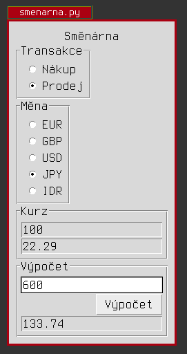

# PRG -- Obsluha směnárny

Navrhněte a vytvořte aplikaci pro obsluhu směnárny -- pro nákup i prodej podle
aktuálního kurzovního lístku. Kurzovní lístek bude aplikace načítat ze
[souboru](listek.txt). **Aplikace bude při čtení kurzovního lístku i
uživatelského vstupu akceptovat jako platný oddělovač desetinných míst jak
desetinnou tečku, tak desetinnou čárku.** :-)

V případě nákupu zadává směnárna měnu a částku, kterou od zákazníka nakupuje, a
výstupem je částka v Kč, kterou zaplatí zákazníkovi. V případě prodeje zadává
směnárna měnu a částku, kterou chce zákazník nakoupit a výstupem je částka v
Kč, kterou má zákazník zaplatit. Uživatel jako výstup uvidí směněnou částku
zaokrouhlenou na celé koruny.

* <http://docs.python.org/2/tutorial/inputoutput.html>
* <https://docs.python.org/3/library/stdtypes.html#str.split>
* <http://tkinter.programujte.com/index.htm>
* <http://tkinter.programujte.com/variable.htm>
